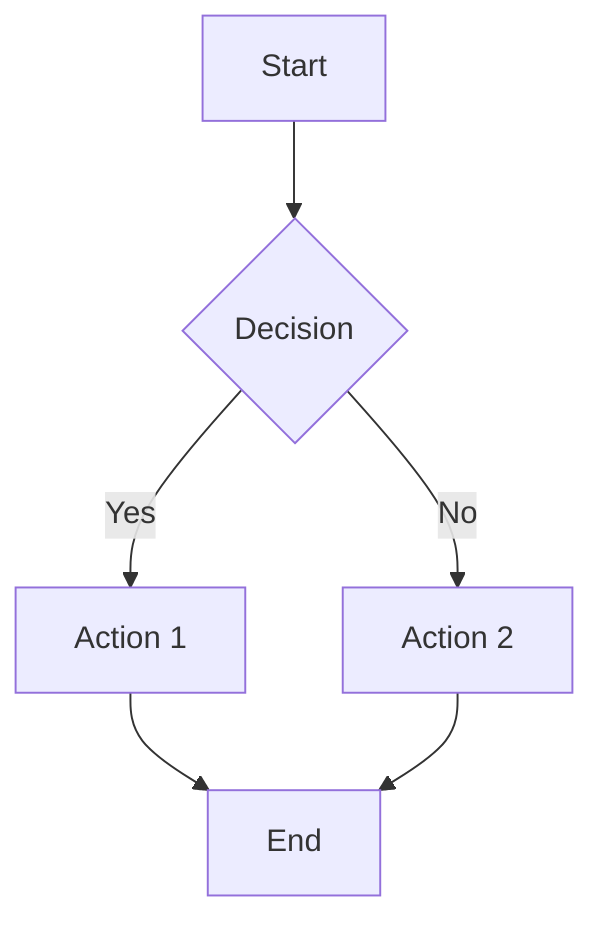
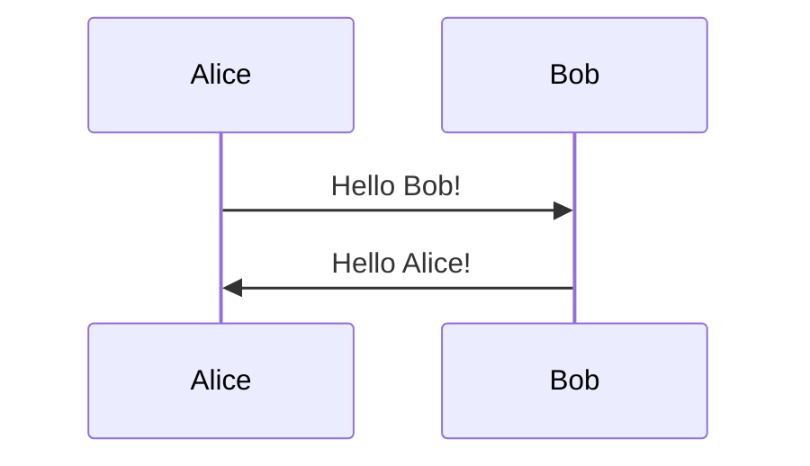
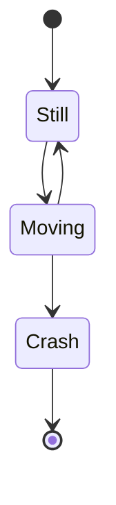
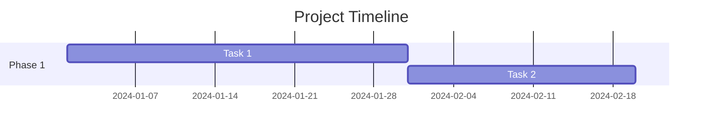
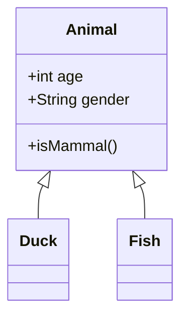

# Feature Guide - Markdown Viewer v2.1.0

Complete guide to all features and capabilities of the Markdown Viewer.

## Table of Contents

- [Core Features](#core-features)
- [PDF Export](#pdf-export)
- [Syntax Highlighting](#syntax-highlighting)
- [Mermaid Diagrams](#mermaid-diagrams)
- [Offline Mode](#offline-mode)
- [Theme System](#theme-system)
- [Advanced Usage](#advanced-usage)

---

## Core Features

### Basic Conversion

Convert any markdown file to beautifully styled HTML:

```bash
./md-viewer.sh document.md
```

This will:
1. Convert markdown to HTML using Pandoc
2. Apply the default theme (github-dark)
3. Add syntax highlighting to code blocks
4. Render Mermaid diagrams
5. Fix internal anchor links
6. Open in your default browser

### Theme Selection

Choose from 8 professionally designed themes:

```bash
# Dark themes
./md-viewer.sh -theme github-dark document.md    # Default
./md-viewer.sh -theme solarized-dark document.md
./md-viewer.sh -theme nord document.md
./md-viewer.sh -theme dracula document.md
./md-viewer.sh -theme monokai document.md

# Light themes
./md-viewer.sh -theme github-light document.md
./md-viewer.sh -theme solarized-light document.md

# High contrast
./md-viewer.sh -theme high-contrast document.md
```

---

## PDF Export

### Basic PDF Export

Export any markdown file directly to PDF:

```bash
./md-viewer.sh -pdf report.md
```

Output: `~/Repos/linuv/pdf/report_rendered.pdf`

### Themed PDF Export

Combine themes with PDF export:

```bash
# Professional light theme for business documents
./md-viewer.sh -theme github-light -pdf business-report.md

# High contrast for presentations
./md-viewer.sh -theme high-contrast -pdf presentation.md

# Nord theme for technical documentation
./md-viewer.sh -theme nord -pdf api-docs.md
```

### Requirements

PDF export requires `wkhtmltopdf`:

```bash
# Ubuntu/Debian
sudo apt-get install wkhtmltopdf

# macOS
brew install wkhtmltopdf

# Fedora
sudo dnf install wkhtmltopdf
```

### PDF Features

- ✅ Preserves all styling from selected theme
- ✅ Includes syntax-highlighted code blocks
- ✅ Renders Mermaid diagrams as SVG
- ✅ Maintains internal links and table of contents
- ✅ Professional print-ready output

---

## Syntax Highlighting

### Automatic Detection

Code blocks are automatically detected and highlighted:

````markdown
```python
def hello_world():
    print("Hello, World!")
```

```javascript
const greeting = () => {
    console.log("Hello, World!");
};
```

```bash
echo "Hello, World!"
```
````

### Supported Languages

Highlight.js supports 190+ languages including:

- Python, JavaScript, TypeScript, Java, C++, C#, Go, Rust
- HTML, CSS, SCSS, JSON, YAML, XML
- Bash, PowerShell, SQL, GraphQL
- Ruby, PHP, Swift, Kotlin, Scala
- And many more...

### Theme-Aware Highlighting

Syntax highlighting automatically matches your selected theme:

- `github-dark` → GitHub Dark syntax theme
- `github-light` → GitHub Light syntax theme
- `nord` → Nord syntax theme
- `dracula` → Dracula syntax theme
- etc.

---

## Mermaid Diagrams

### Supported Diagram Types

All Mermaid diagram types are supported:

#### Flowcharts

````markdown

````

#### Sequence Diagrams

````markdown

````

#### State Diagrams

````markdown

````

#### Gantt Charts

````markdown

````

#### Class Diagrams

````markdown

````

### Theme-Aware Diagrams

Mermaid diagrams automatically match your theme:

- **Light themes** (github-light, solarized-light) → Use Mermaid 'default' theme
- **Dark themes** (all others) → Use Mermaid 'dark' theme

This ensures diagrams are always readable and visually consistent.

---

## Offline Mode

### Setup

Download all dependencies for offline use:

```bash
cd ~/Repos/linuv
./setup-offline.sh
```

This downloads:
- Mermaid.js v10.9.0
- Highlight.js v11.9.0
- All theme stylesheets

### Usage

Enable offline mode:

```bash
# Set environment variable
export OFFLINE_MODE=true
./md-viewer.sh document.md

# Or inline
OFFLINE_MODE=true ./md-viewer.sh document.md
```

### Benefits

- ✅ No internet connection required
- ✅ Faster loading (local files)
- ✅ Works in air-gapped environments
- ✅ Consistent versions (no CDN changes)
- ✅ Privacy (no external requests)

### Fallback

If offline files are missing, the script automatically falls back to CDN with a warning.

---

## Theme System

### Available Themes

| Theme | Type | Best For |
|-------|------|----------|
| github-dark | Dark | General use, coding docs |
| github-light | Light | Professional documents |
| solarized-dark | Dark | Extended reading |
| solarized-light | Light | Extended reading |
| nord | Dark | Technical docs, minimalist |
| dracula | Dark | Creative projects |
| monokai | Dark | Code-heavy documents |
| high-contrast | Dark | Accessibility, presentations |

### Theme Components

Each theme controls:
1. **Background and text colors**
2. **Heading styles**
3. **Link colors**
4. **Code block styling**
5. **Table formatting**
6. **Blockquote appearance**
7. **Syntax highlighting colors**
8. **Mermaid diagram theme**

### Custom Themes

Create your own theme:

1. Copy an existing theme:
   ```bash
   cp assets/github-dark.css assets/my-theme.css
   ```

2. Edit colors and styles in `my-theme.css`

3. Add to available themes in `md-viewer.sh`:
   ```bash
   AVAILABLE_THEMES=(
       "github-dark"
       "my-theme"  # Add here
       ...
   )
   ```

4. Use it:
   ```bash
   ./md-viewer.sh -theme my-theme document.md
   ```

---

## Advanced Usage

### Batch Conversion

Convert multiple files:

```bash
# Convert all markdown files with default theme
for file in *.md; do
    ./md-viewer.sh "$file"
done

# Convert with specific theme
for file in docs/*.md; do
    ./md-viewer.sh -theme nord "$file"
done

# Export all as PDFs
for file in reports/*.md; do
    ./md-viewer.sh -theme github-light -pdf "$file"
done
```

### System-Wide Installation

Install for use from anywhere:

```bash
sudo ln -s ~/Repos/linuv/md-viewer.sh /usr/local/bin/md-viewer

# Now use from any directory
cd ~/Documents
md-viewer notes.md
md-viewer -theme dracula -pdf report.md
```

### Integration with Git Hooks

Auto-generate HTML on commit:

```bash
#!/bin/bash
# .git/hooks/pre-commit

for file in $(git diff --cached --name-only | grep '\.md$'); do
    ~/Repos/linuv/md-viewer.sh "$file"
done
```

### Environment Variables

Customize behavior:

```bash
# Enable offline mode
export OFFLINE_MODE=true

# Set default theme
export MD_VIEWER_THEME=nord

# Custom output directory (requires script modification)
export OUTPUT_DIR=/path/to/output
```

### Troubleshooting

#### Diagrams Not Rendering

1. Check internet connection (if not in offline mode)
2. Verify Mermaid syntax is correct
3. Check browser console for JavaScript errors
4. Try regenerating the file

#### PDF Export Fails

1. Verify wkhtmltopdf is installed: `which wkhtmltopdf`
2. Check for JavaScript errors in HTML
3. Try HTML export first to verify content
4. Ensure sufficient disk space

#### Syntax Highlighting Missing

1. Check code block has language specified
2. Verify internet connection (if not in offline mode)
3. Check browser console for errors
4. Try a different theme

#### Offline Mode Not Working

1. Run `./setup-offline.sh` to download dependencies
2. Verify files exist in `vendor/` directory
3. Check file permissions
4. Try with `OFFLINE_MODE=false` to test CDN

---

## Performance Tips

1. **Use offline mode** for faster loading
2. **Batch convert** multiple files at once
3. **Cache PDFs** instead of regenerating
4. **Use appropriate themes** (light themes are slightly faster)
5. **Minimize large diagrams** in documents

---

## Best Practices

### For Documentation

- Use `github-light` or `solarized-light` for professional docs
- Include table of contents for long documents
- Use consistent heading hierarchy
- Add code examples with syntax highlighting

### For Presentations

- Use `high-contrast` theme for maximum readability
- Export as PDF for portability
- Keep diagrams simple and clear
- Use large fonts in markdown

### For Technical Writing

- Use `nord` or `github-dark` for code-heavy content
- Include plenty of code examples
- Use Mermaid for architecture diagrams
- Export as both HTML and PDF

### For Sharing

- Export as PDF for universal compatibility
- Use light themes for printing
- Test on different devices
- Include all necessary context

---

**Version 2.1.0** | Complete Feature Guide