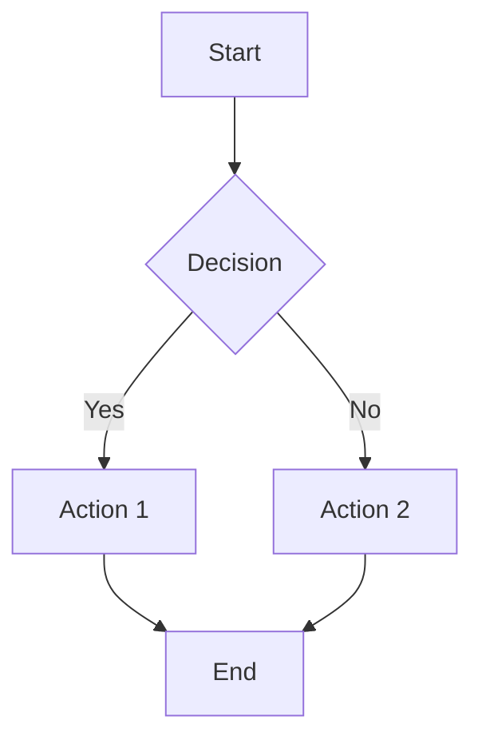

# Markdown Viewer with Multiple Themes

A simple, elegant tool to convert Markdown files to styled HTML and view them in your browser with 8 beautiful themes to choose from.

## Features

✨ **8 Beautiful Themes**: GitHub, Solarized, Nord, Dracula, Monokai, and High Contrast
🚀 **Quick & Easy**: One command to convert and view
🎨 **Highly Customizable**: Switch themes with a simple flag
📱 **Cross-Platform**: Works on Linux and macOS
🔧 **Smart**: Auto-detects CSS files and handles errors gracefully
📊 **Mermaid Diagrams**: Automatically renders flowcharts, sequence diagrams, and more
🎨 **Theme-Aware Mermaid**: Diagrams automatically match your selected theme
💡 **Syntax Highlighting**: Beautiful code highlighting with Highlight.js
📄 **PDF Export**: Convert directly to PDF with `-pdf` flag
🔌 **Offline Mode**: Optional offline support for all dependencies
🔗 **Symlink-Friendly**: Works correctly when installed system-wide via symlink
🔗 **Fixed Internal Links**: Table of contents and anchor links work perfectly
⚡ **HTML Entity Decoding**: Properly handles special characters in diagrams

## Recent Updates

### Version 2.1.2 (Latest) - PDF Enhancement 🚀
- ✅ **Automated PDF Generation**: Now uses Chrome/Chromium headless for fully automated PDF export
- ✅ **No User Interaction**: PDF generation works without manual browser steps
- ✅ **macOS Support**: Automatically detects and uses Google Chrome on macOS
- ✅ **Linux Support**: Automatically detects and uses Chromium on Linux
- ✅ **Multiple Fallbacks**: Tries 5 different methods to ensure PDF generation works

### Version 2.1.1 - Hotfix 🔧
- 🐛 **Fixed Offline Mermaid**: Corrected offline Mermaid.js bundle download (was downloading ESM wrapper instead of full library)
- ✅ **Improved Offline Mode**: Now uses proper standalone Mermaid bundle for offline rendering
- ✅ **Better Module Detection**: Automatically switches between ESM import (online) and script tag (offline)

### Version 2.1.0 - NEW! 🎉
- ✅ **PDF Export**: Export markdown directly to PDF with `-pdf` flag
- ✅ **Syntax Highlighting**: Automatic code syntax highlighting with Highlight.js
- ✅ **Theme-Aware Mermaid**: Mermaid diagrams now match your selected theme (light/dark)
- ✅ **Offline Mode**: Optional offline support - no internet required after setup
- ✅ **Setup Script**: Easy offline dependency download with `setup-offline.sh`

### Version 2.0
- ✅ **Mermaid.js Integration**: Full support for rendering Mermaid diagrams
- ✅ **Symlink Resolution**: Fixed script to work correctly when installed via symlink
- ✅ **Internal Link Fixes**: Table of contents and all internal anchor links work correctly
- ✅ **HTML Entity Decoding**: Properly decodes HTML entities in diagrams

### Version 1.0
- Initial release with 8 theme support
- Basic Pandoc integration
- Cross-platform browser opening

## Installation

### Quick Setup

```bash
# Clone or navigate to the linuv directory
cd ~/Repos/linuv

# The script is ready to use!
./md-viewer.sh your-file.md
```

### System-Wide Installation (Recommended)

```bash
# Make it available from anywhere
sudo ln -s ~/Repos/linuv/md-viewer.sh /usr/local/bin/md-viewer

# Now use it from any directory
md-viewer ~/Documents/notes.md
```

**Note**: The script properly resolves symlinks, so it will always find its CSS themes and create output files in the correct location (`~/Repos/linuv/html/`), even when called via the symlink.

### Add to PATH (Alternative)

Add to your `~/.bashrc` or `~/.zshrc`:

```bash
export PATH="$HOME/Repos/linuv:$PATH"
```

Then reload: `source ~/.bashrc` or `source ~/.zshrc`

## Usage

### Basic Usage

```bash
# Convert with default theme (github-dark)
./md-viewer.sh document.md

# Convert with a specific theme
./md-viewer.sh -theme dracula document.md

# Export as PDF
./md-viewer.sh -pdf report.md

# Combine theme and PDF export
./md-viewer.sh -theme nord -pdf presentation.md

# Show help and available themes
./md-viewer.sh --help
```

### Examples

```bash
# View your README with default GitHub dark theme
./md-viewer.sh README.md

# View documentation with GitHub light theme
./md-viewer.sh -theme github-light docs/api-guide.md

# Use the vibrant Dracula theme
./md-viewer.sh -theme dracula notes.md

# High contrast for accessibility
./md-viewer.sh -theme high-contrast important-doc.md

# From anywhere (if installed system-wide)
md-viewer -theme nord ~/projects/notes/meeting-notes.md

# Export technical documentation as PDF
md-viewer -theme github-light -pdf ~/docs/api-guide.md

# Create presentation-ready PDF
md-viewer -theme high-contrast -pdf ~/slides/presentation.md
```

### Offline Mode

For environments without internet access:

```bash
# One-time setup: Download dependencies
cd ~/Repos/linuv
./setup-offline.sh

# Enable offline mode
export OFFLINE_MODE=true
./md-viewer.sh document.md

# Or set it inline
OFFLINE_MODE=true ./md-viewer.sh document.md
```

## Available Themes

### Light Themes

**github-light**
- Clean white background
- High contrast for readability
- Matches GitHub's default theme
- Perfect for: Documentation, professional documents

**solarized-light**
- Warm, cream background (#fdf6e3)
- Carefully designed color palette
- Easy on the eyes for extended reading
- Perfect for: Long documents, technical writing

### Dark Themes

**github-dark** (Default)
- Dark background (#0d1117)
- Optimized for low-light environments
- Matches GitHub's dark mode
- Perfect for: General use, coding documentation

**solarized-dark**
- Warm dark background (#002b36)
- Balanced contrast
- Reduces eye strain
- Perfect for: Night reading, extended sessions

**nord**
- Cool, arctic-inspired palette
- Frost blue accents
- Clean and modern
- Perfect for: Technical docs, minimalist aesthetic

**dracula**
- Vibrant purple and pink accents
- Fun and energetic
- High saturation colors
- Perfect for: Creative projects, presentations

**monokai**
- Inspired by Sublime Text
- Rainbow gradient separators
- Colorful syntax highlighting
- Perfect for: Code-heavy documents, tutorials

### High Contrast

**high-contrast**
- Pure black background
- Pure white text
- Maximum readability
- Bold, clear typography
- Perfect for: Accessibility, presentations, vision impairment

## Output

### HTML Output
Generated HTML files are saved to `~/Repos/linuv/html/` with the format:
```
~/Repos/linuv/html/<filename>_rendered.html
```

### PDF Output
Generated PDF files are saved to `~/Repos/linuv/pdf/` with the format:
```
~/Repos/linuv/pdf/<filename>_rendered.pdf
```

The file automatically opens in your default browser (HTML) or PDF viewer (PDF). All generated files are kept in organized locations for easy access and sharing.

### Mermaid Diagram Support

The viewer automatically renders Mermaid diagrams embedded in your markdown files. Supported diagram types include:

- **Flowcharts**: Process flows and decision trees
- **Sequence Diagrams**: Interaction timelines
- **Class Diagrams**: Object-oriented structures
- **State Diagrams**: State machines
- **Gantt Charts**: Project timelines
- **Pie Charts**: Data visualization
- **And more**: See [Mermaid documentation](https://mermaid.js.org/)

Example markdown with Mermaid:

````markdown

````

The diagrams will render automatically in the HTML output with dark theme styling that matches your selected CSS theme.

## Sharing with Your Team

### Quick Share

```bash
# Generate the HTML
./md-viewer.sh -theme light team-update.md

# Share the file at: ~/Repos/linuv/html/team-update_rendered.html
# Send via email, Slack, or any file sharing service
```

### Permanent Files

All HTML files are automatically saved in `~/Repos/linuv/html/` and persist until you delete them. To save to a different location:

```bash
# Use pandoc directly with custom output path
pandoc document.md -s -c ~/Repos/linuv/assets/github-dark.css \
  -o /path/to/output/document.html
```

## Project Structure

```
linuv/
├── md-viewer.sh              # Main conversion script
├── README.md                 # This file
├── html/                     # Generated HTML files (auto-created)
│   └── *.html               # Your converted documents
└── assets/                   # Theme stylesheets
    ├── github-dark.css       # GitHub dark theme
    ├── github-light.css      # GitHub light theme
    ├── solarized-dark.css    # Solarized dark theme
    ├── solarized-light.css   # Solarized light theme
    ├── nord.css              # Nord theme
    ├── dracula.css           # Dracula theme
    ├── monokai.css           # Monokai theme
    └── high-contrast.css     # High contrast theme
```

## Requirements

- **pandoc**: Markdown to HTML converter
  - Ubuntu/Debian: `sudo apt-get install pandoc`
  - macOS: `brew install pandoc`
  - Fedora: `sudo dnf install pandoc`

## Advanced Usage

### Batch Convert Multiple Files

```bash
# Convert all markdown files with default theme
for file in *.md; do
    ./md-viewer.sh "$file"
done

# Convert all with a specific theme
for file in *.md; do
    ./md-viewer.sh -theme dracula "$file"
done

# Convert different files with different themes
./md-viewer.sh -theme github-light README.md
./md-viewer.sh -theme nord CONTRIBUTING.md
./md-viewer.sh -theme high-contrast ACCESSIBILITY.md
```

### Custom Output Location

By default, files are saved to `~/Repos/linuv/html/`. To change this, edit the script:

```bash
# Lines 65-67 in md-viewer.sh
OUTPUT_DIR="${SCRIPT_DIR}/html"
mkdir -p "$OUTPUT_DIR"
OUTPUT_FILE="${OUTPUT_DIR}/${BASENAME}_rendered.html"

# Change OUTPUT_DIR to your preferred location:
OUTPUT_DIR="/path/to/your/output"
```

### Integration with Git Hooks

Create a pre-commit hook to auto-generate HTML:

```bash
#!/bin/bash
# .git/hooks/pre-commit

for file in $(git diff --cached --name-only | grep '\.md$'); do
    ~/Repos/linuv/md-viewer.sh "$file"
done
```

## Customization

### Modify Existing Themes

Edit any CSS file in `assets/` to customize colors and styling:

```bash
# Edit a theme
nano ~/Repos/linuv/assets/dracula.css
```

All themes use CSS variables for easy customization.

### Add New Themes

1. Create a new CSS file in `assets/`:
```bash
cp assets/github-dark.css assets/my-theme.css
```

2. Edit the new theme file with your colors

3. Add your theme to the script's `AVAILABLE_THEMES` array in [`md-viewer.sh`](md-viewer.sh:8-17)

4. Use it:
```bash
./md-viewer.sh -theme my-theme document.md
```

## Technical Details

### Symlink Resolution

The script uses robust symlink resolution to ensure it always finds its assets and creates output in the correct location:

```bash
# Even when called via symlink, the script resolves to its actual location
SOURCE="${BASH_SOURCE[0]}"
while [ -h "$SOURCE" ]; do
    SCRIPT_DIR="$(cd -P "$(dirname "$SOURCE")" && pwd)"
    SOURCE="$(readlink "$SOURCE")"
    [[ $SOURCE != /* ]] && SOURCE="$SCRIPT_DIR/$SOURCE"
done
SCRIPT_DIR="$(cd -P "$(dirname "$SOURCE")" && pwd)"
```

This means:
- CSS themes are always found in `~/Repos/linuv/assets/`
- HTML output always goes to `~/Repos/linuv/html/`
- No permission errors when installed in `/usr/local/bin/`

### Mermaid Integration

After Pandoc converts the markdown to HTML, the script automatically injects Mermaid.js:

```bash
# Mermaid.js is loaded from CDN and initialized with dark theme
<script type="module">
  import mermaid from "https://cdn.jsdelivr.net/npm/mermaid@10/dist/mermaid.esm.min.mjs";
  mermaid.initialize({ startOnLoad: true, theme: "dark" });
</script>
```

This happens automatically for all conversions, so any `mermaid` code blocks in your markdown will render as interactive diagrams.

## Troubleshooting

### Permission Denied Errors

If you see errors like `mkdir: /usr/local/bin/html: Permission denied`, your script may be outdated. The latest version properly resolves symlinks to avoid this issue. Update by pulling the latest changes.

### Pandoc Not Found

```bash
# Install pandoc
# Ubuntu/Debian
sudo apt-get install pandoc

# macOS
brew install pandoc

# Fedora
sudo dnf install pandoc
```

### CSS Not Loading

Check that CSS files exist:
```bash
ls -la ~/Repos/linuv/assets/
```

Should show:
- `github-dark.css`
- `github-light.css`

### Browser Doesn't Open

The HTML file is still created in `~/Repos/linuv/html/`. Open it manually:
```bash
# Find your file
ls ~/Repos/linuv/html/

# Open manually
xdg-open ~/Repos/linuv/html/your-file_rendered.html  # Linux
open ~/Repos/linuv/html/your-file_rendered.html      # macOS
```

### Mermaid Diagrams Not Rendering

If diagrams appear as code blocks instead of rendered diagrams:

1. Check your internet connection (Mermaid.js loads from CDN)
2. Open browser console (F12) to check for JavaScript errors
3. Ensure your markdown uses proper mermaid code block syntax:
   ````markdown
   ```mermaid
   flowchart TD
       A --> B
   ```
   ````
4. Try regenerating the HTML file with the latest version of the script

## Tips & Best Practices

1. **Choose the right theme**:
   - Use `github-light` for professional/formal documents
   - Use `dracula` or `monokai` for creative/fun content
   - Use `high-contrast` for accessibility or presentations
   - Use `solarized-*` for extended reading sessions

2. **Use descriptive filenames**: The HTML title is based on your filename

3. **Preview before sharing**: Always check the output before sending to team

4. **Batch processing**: Convert multiple files at once with different themes

5. **Version control**: Keep this project in git to track theme changes

6. **Theme consistency**: Use the same theme for related documents

## Changelog

### v2.1.2 - 2024-05-15
**Enhancement: Automated PDF Generation**

#### Added
- Chrome/Chromium headless PDF generation (fully automated)
- Automatic detection of Chrome on macOS
- Automatic detection of Chromium on Linux
- 5-tier fallback system for PDF generation
- Comprehensive error messages with installation guidance

#### Changed
- PDF export now works without user interaction
- Removed manual browser print workflow
- Improved PDF generation reliability across platforms

#### Fixed
- macOS PDF export now works out-of-the-box with Chrome
- No longer requires wkhtmltopdf installation on macOS
- Better error handling for missing PDF tools

### v2.1.1 - 2024-05-15
**Hotfix: Offline Mode Mermaid Rendering**

#### Fixed
- Offline mode Mermaid.js download now gets full standalone bundle instead of ESM wrapper
- Changed from `mermaid.esm.min.mjs` (76 bytes wrapper) to `mermaid.min.js` (~1MB full library)
- Fixed offline mode to use regular script tag instead of ESM module import
- Mermaid diagrams now render correctly in offline mode

#### Changed
- `setup-offline.sh` now downloads correct Mermaid bundle
- Script automatically detects and uses appropriate loading method (ESM vs script tag)

### v2.1.0 - 2024-05-15
**Feature Release: PDF Export, Syntax Highlighting & Offline Mode**

#### Added
- PDF export functionality with `-pdf` flag
- Syntax highlighting for code blocks using Highlight.js 11.9.0
- Theme-aware Mermaid diagrams (light themes use 'default', dark themes use 'dark')
- Offline mode support with local vendor files
- `setup-offline.sh` script for downloading dependencies
- Automatic fallback to CDN if offline files missing
- PDF output directory (`~/Repos/linuv/pdf/`)

#### Changed
- Mermaid theme now dynamically matches selected CSS theme
- Enhanced help text with PDF export examples
- Improved resource loading logic (CDN vs local files)

### v2.0.0 - 2024-05-15
**Major Update: Mermaid Support & Bug Fixes**

#### Added
- Mermaid.js v10.9.0 integration for diagram rendering
- Support for all Mermaid diagram types (flowcharts, sequence, state, gantt, etc.)
- Automatic HTML entity decoding for diagram syntax
- Internal anchor link fixing for proper navigation
- Comprehensive technical documentation

#### Fixed
- Symlink resolution when installed in `/usr/local/bin/`
- Permission errors when creating output directories
- Table of contents links not working
- Mermaid diagrams showing as code blocks instead of rendering
- HTML entities breaking diagram syntax (`-->` → `-->`)

#### Changed
- Improved post-processing with Perl for better HTML manipulation
- Enhanced error messages and warnings
- Updated README with technical details and troubleshooting

### v1.0.0 - Initial Release
- 8 beautiful themes (GitHub, Solarized, Nord, Dracula, Monokai, High Contrast)
- Pandoc-based Markdown to HTML conversion
- Cross-platform browser opening
- Theme selection via command-line flag
- Automatic CSS detection

## Contributing

Feel free to:
- Add new themes
- Improve the script
- Report issues
- Suggest features
- Submit pull requests

## Known Limitations

- PDF export requires wkhtmltopdf to be installed
- Offline mode requires one-time setup with `setup-offline.sh`
- Large files may take a moment to process due to HTML post-processing
- PDF rendering of Mermaid diagrams depends on wkhtmltopdf's JavaScript support

## Roadmap

- [x] ~~Offline Mermaid.js support~~ ✅ v2.1.0
- [x] ~~Theme-aware Mermaid diagram styling~~ ✅ v2.1.0
- [x] ~~PDF export option~~ ✅ v2.1.0
- [x] ~~Syntax highlighting for code blocks~~ ✅ v2.1.0
- [ ] Watch mode for auto-regeneration
- [ ] Custom output directory configuration
- [ ] Table of contents auto-generation
- [ ] Custom CSS injection
- [ ] Batch conversion with progress bar

## License

This project is licensed under the MIT License - see the [LICENSE](LICENSE) file for details.

**TL;DR:** Free to use, modify, and distribute for personal and commercial projects. Attribution required.

## Credits

- Themes based on GitHub's official color schemes
- Built with [Pandoc](https://pandoc.org/)
- Diagram rendering powered by [Mermaid.js](https://mermaid.js.org/)
- Inspired by the need for quick, beautiful Markdown previews

## Support

If you encounter issues:
1. Check the [Troubleshooting](#troubleshooting) section
2. Ensure you have the latest version of the script
3. Verify Pandoc is installed and up to date
4. For PDF issues, see [PDF Export Issues](#pdf-export-issues)
5. Check your internet connection (required for online mode)

---

**Made with ❤️ for better Markdown viewing**
**Version 2.1.2** | Last updated: May 15, 2024