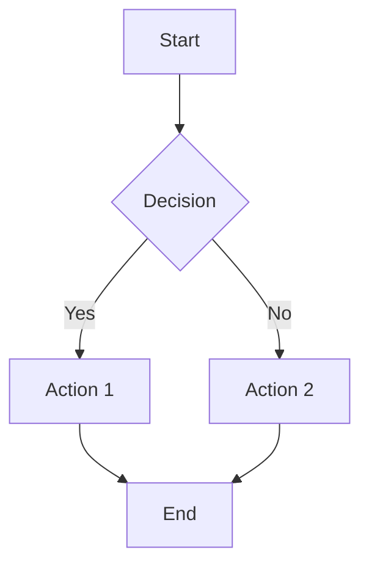

# Linuv Markdown Viewer - Chrome Extension

Beautiful markdown viewer with 8 themes, Mermaid diagrams, and syntax highlighting for Google Chrome.

## Features

- **8 Beautiful Themes**: GitHub, Solarized, Nord, Dracula, Monokai, and High Contrast
- **Automatic Rendering**: Instantly renders .md files opened in Chrome
- **Mermaid Diagrams**: Automatic rendering of flowcharts, sequence diagrams, and more
- **Syntax Highlighting**: Beautiful code highlighting with Highlight.js
- **Theme Switching**: Easily switch between themes via popup
- **Print/PDF Export**: Built-in print functionality for PDF export
- **Offline Mode**: Optional offline support for all dependencies

## Installation

### From Chrome Web Store (Coming Soon)

1. Visit the Chrome Web Store
2. Search for "Linuv Markdown Viewer"
3. Click "Add to Chrome"

### From Source (Developer Mode)

1. Clone the repository
2. Open Chrome and navigate to `chrome://extensions/`
3. Enable "Developer mode" (toggle in top-right corner)
4. Click "Load unpacked"
5. Select the `chrome-extension` directory from the linuv repository
6. **Important**: Click "Details" on the extension and enable "Allow access to file URLs"

## Usage

### View Markdown Files

1. Open any `.md` or `.markdown` file in Chrome using `File > Open File` or drag-and-drop
2. The extension automatically renders the markdown with your selected theme
3. Use the toolbar buttons in the top-right to change theme or print

### Change Theme

1. Click the Linuv extension icon in Chrome toolbar
2. Select your preferred theme from the dropdown
3. The page will automatically reload with the new theme

### Available Themes

- **github-dark** (Default) - GitHub's dark theme
- **github-light** - GitHub's light theme
- **solarized-dark** - Solarized dark (warm, easy on eyes)
- **solarized-light** - Solarized light (warm, easy on eyes)
- **nord** - Nord (cool, arctic-inspired)
- **dracula** - Dracula (vibrant purple accents)
- **monokai** - Monokai (colorful, Sublime-inspired)
- **high-contrast** - Maximum readability

### Export to PDF

1. Open a markdown file in Chrome
2. Click the "Print/PDF" button in the toolbar, or
3. Use Chrome's print function (Ctrl+P / Cmd+P)
4. Select "Save as PDF" as the destination
5. Click "Save"

## Configuration

Click the extension icon to access settings:

- **Theme**: Choose your preferred theme
- **Offline Mode**: Use local files instead of CDN (requires setup)

## Mermaid Diagram Support

The extension automatically renders Mermaid diagrams. Supported diagram types include:

- Flowcharts
- Sequence Diagrams
- Class Diagrams
- State Diagrams
- Gantt Charts
- Pie Charts
- And more...

Example:

````markdown

````

## Important Notes

### File URL Access

To view local markdown files, you **must** enable "Allow access to file URLs":

1. Go to `chrome://extensions/`
2. Find "Linuv Markdown Viewer"
3. Click "Details"
4. Enable "Allow access to file URLs"

Without this permission, the extension cannot render local .md files.

### Security

This extension only runs on local `.md` and `.markdown` files. It does not access any web pages or collect any data.

## Troubleshooting

### Extension Not Working

1. Verify "Allow access to file URLs" is enabled
2. Check that the file has `.md` or `.markdown` extension
3. Try reloading the extension in `chrome://extensions/`
4. Reload the markdown file

### Diagrams Not Rendering

1. Check internet connection (unless offline mode is enabled)
2. Verify Mermaid syntax is correct
3. Open browser console (F12) to check for errors
4. Try a different theme

### Theme Not Changing

1. Reload the markdown file after changing theme
2. Check that settings are saved (status message appears)
3. Clear browser cache if issues persist

## Offline Mode

For offline use:

1. Copy vendor files to `chrome-extension/vendor/` directory:
   - `mermaid.min.js`
   - `highlight.min.js`
   - `hljs-styles/` directory with theme CSS files
2. Enable "Offline Mode" in extension settings
3. Reload markdown files

## Keyboard Shortcuts

- **Ctrl+P / Cmd+P**: Print or save as PDF
- **F5**: Reload page with current theme
- **F12**: Open developer console (for debugging)

## Privacy

This extension:
- ✅ Only runs on local markdown files
- ✅ Does not collect any data
- ✅ Does not track your activity
- ✅ Does not require account or login
- ✅ Works completely offline (with offline mode enabled)

## Related Projects

- [Linuv CLI Tool](https://github.com/yourusername/linuv) - Full-featured command-line markdown viewer with PDF export
- [Linuv VSCode Extension](https://marketplace.visualstudio.com/items?itemName=linuv.linuv-markdown-viewer) - VSCode integration

## Support

For issues and feature requests, please visit the [GitHub repository](https://github.com/yourusername/linuv).

## License

MIT License - see LICENSE file for details

## Version History

### 1.0.0 (Initial Release)
- 8 beautiful themes
- Mermaid diagram support
- Syntax highlighting
- Print/PDF export
- Offline mode support
- Theme switching