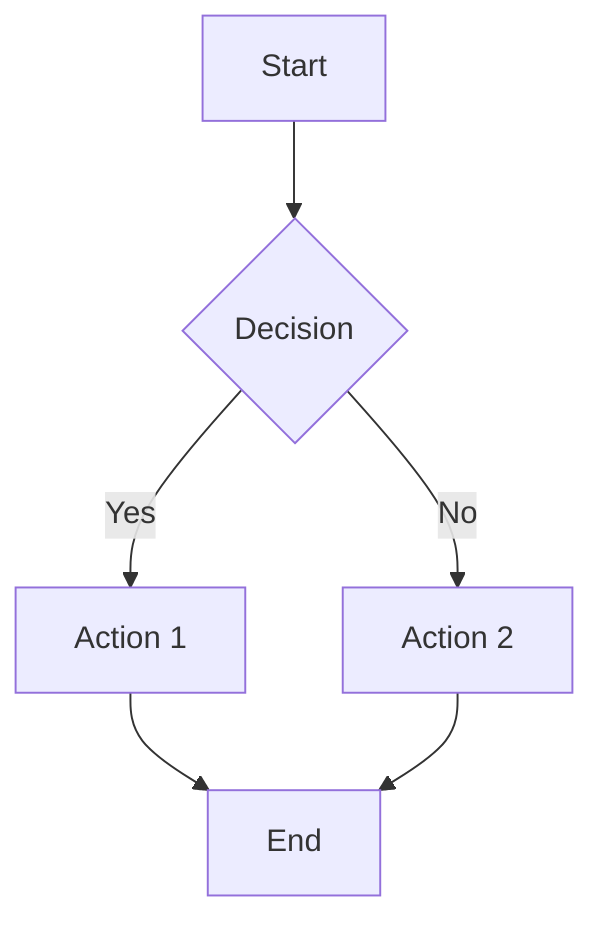

# Linuv Markdown Viewer - VSCode Extension

Beautiful markdown preview with 8 themes, Mermaid diagrams, and syntax highlighting for Visual Studio Code.

## Features

- **8 Beautiful Themes**: GitHub, Solarized, Nord, Dracula, Monokai, and High Contrast
- **Live Preview**: Real-time markdown preview as you type
- **Mermaid Diagrams**: Automatic rendering of flowcharts, sequence diagrams, and more
- **Syntax Highlighting**: Beautiful code highlighting with Highlight.js
- **Theme Switching**: Easily switch between themes
- **Offline Mode**: Optional offline support for all dependencies

## Installation

### From VSIX File

1. Download the `.vsix` file from releases
2. Open VSCode
3. Go to Extensions (Ctrl+Shift+X / Cmd+Shift+X)
4. Click the "..." menu at the top
5. Select "Install from VSIX..."
6. Choose the downloaded `.vsix` file

### From Source

1. Clone the repository
2. Navigate to `vscode-extension` directory
3. Run `npm install` (if you want to package it)
4. Run `vsce package` to create a `.vsix` file
5. Install the `.vsix` file as described above

## Usage

### Preview Markdown

1. Open any `.md` file in VSCode
2. Click the preview icon in the editor title bar, or
3. Right-click in the editor and select "Linuv: Preview Markdown", or
4. Use Command Palette (Ctrl+Shift+P / Cmd+Shift+P) and type "Linuv: Preview Markdown"

### Change Theme

1. Use Command Palette (Ctrl+Shift+P / Cmd+Shift+P)
2. Type "Linuv: Change Theme"
3. Select your preferred theme from the list

### Available Themes

- **github-dark** (Default) - GitHub's dark theme
- **github-light** - GitHub's light theme
- **solarized-dark** - Solarized dark (warm, easy on eyes)
- **solarized-light** - Solarized light (warm, easy on eyes)
- **nord** - Nord (cool, arctic-inspired)
- **dracula** - Dracula (vibrant purple accents)
- **monokai** - Monokai (colorful, Sublime-inspired)
- **high-contrast** - Maximum readability

## Configuration

Open VSCode settings (File > Preferences > Settings) and search for "Linuv":

- **linuv.theme**: Default theme for markdown preview (default: `github-dark`)
- **linuv.autoPreview**: Automatically open preview when opening markdown files (default: `false`)
- **linuv.offlineMode**: Use local vendor files instead of CDN (default: `false`)

## Mermaid Diagram Support

The extension automatically renders Mermaid diagrams. Supported diagram types include:

- Flowcharts
- Sequence Diagrams
- Class Diagrams
- State Diagrams
- Gantt Charts
- Pie Charts
- And more...

Example:

````markdown

````

## Requirements

- Visual Studio Code 1.74.0 or higher
- Internet connection (unless offline mode is enabled)

## Known Limitations

- Basic markdown parsing (for full Pandoc features, use the CLI tool)
- PDF export requires the command-line tool
- Offline mode requires manual setup of vendor files

## Related Projects

- [Linuv CLI Tool](https://github.com/yourusername/linuv) - Full-featured command-line markdown viewer with PDF export

## License

MIT License - see LICENSE file for details

## Support

For issues and feature requests, please visit the [GitHub repository](https://github.com/yourusername/linuv).